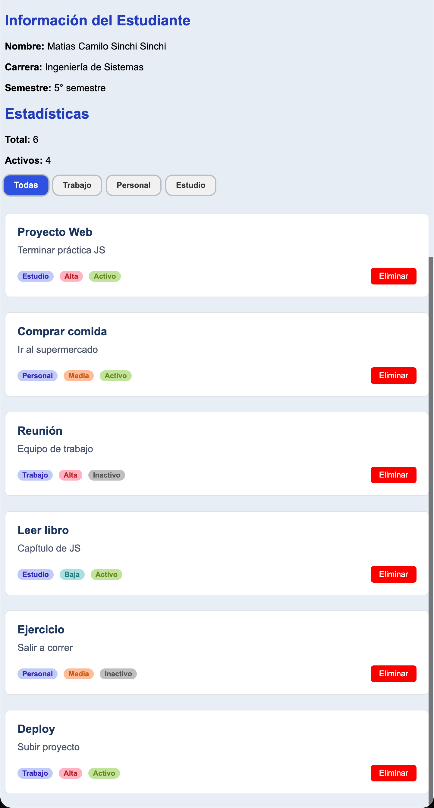
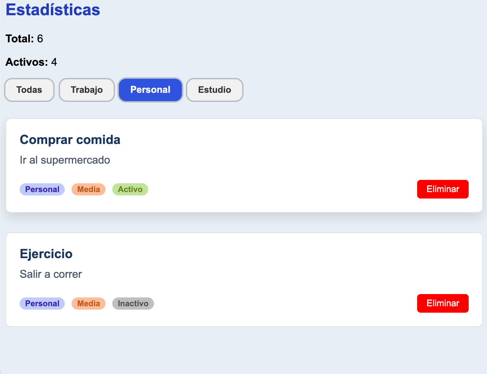

Empezamos con la modificion basica de fuentes y tamaño, empece con el diseño de los botnes y de los badges y luego con el layout.
```css
.btn-filtro {
    font-weight: bold;
    padding: 8px 16px;
    background: rgb(241, 241, 241);
    color: rgb(51, 51, 51);
    border-radius: 10px;
    box-shadow: 0 0 0 2px rgba(0,0,0,0.2);
    border: none;
    cursor: pointer;
    transition: all 0.3s ease;
}
```
en la modificacion de los botones ya agragamos un poco de hover para familiarizarnos para el uso de este en las ``.card``

Continuamos con la badges las cuales obtenemos su nombre del JS, primero creamos una badge predeterminada con los atributos base como estos:
```css
badge {
    display: inline-block;
    padding: 2px 8px;
    border-radius: 12px;
    font-size: 12px;
    font-weight: bold;
}
```
Con esto logramos no ser redundantes en el codigo y que sea mejor para su lectura.

Al querer usar estas clases se fortalecio el concepto de las clases debido a que en el moemnto de diferenciar una badge de otra cometi el error de typear ``.badge .badge-categoria`` con un espacio " " en medio de estas, lo cual me daba error apesar de tener sentido la estructura, lo que entendie es que cuando ponia el " " le decia a css que busque un elemento ``badge-categoria`` dentro de una clase ``badge`` pero en el JS estaba que este elemento tenia ambas clases, NO una dentro de otra, al momento de arreglar esto funciono.

```css
.card {
    background: #ffffff;
    padding: 20px;
    margin-bottom: 15px;
    border-radius: 8px;
    border: 1px solid #e0e0e0;
    display: grid;
    grid-template-columns: 1fr auto; 
    grid-template-areas:
        "titulo titulo"
        "descripcion descripcion"
        "badges acciones";
    gap: 10px; 
    transition: transform 0.3s ease, box-shadow 0.3s ease;
}
```
Continuamos con estilo del card, primero se usa el css grid para generar las filas y columnas necesarias y con el uso de ``grid-template-columns: 1fr auto;`` hacemos el dise ño responsivo para que este pueda acoplarse al flexbox de la misma forma. tambien se le agrago una sombra al momento de acesrcar el mouse a la card.

Asiganamos los espacios a las columanas y finalizamos con consultar si la pantalla es de 600px o menor cambiamos las reglas y la ajustamos con funciones de flexbox
```css
@media (max-width: 600px) {
    .card {
        grid-template-columns: 1fr;
        grid-template-areas:
            "titulo"
            "descripcion"
            "badges"
            "acciones";
    }
    
    .card-actions {
        margin-top: 15px;
        justify-content: flex-end;
    }
    
    .filtros {
        flex-wrap: wrap; 
    }
}
``` 
Quedandonos la vista de esta forma 


Tambien se demuestra el uso del filtrado para demostrar los cambio en ``btn-filtro y btn-fitro-activo``

