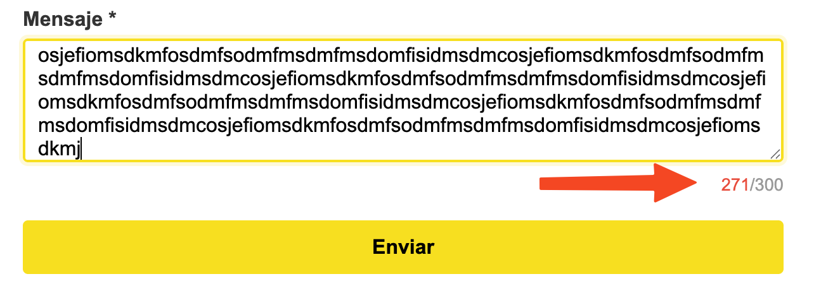
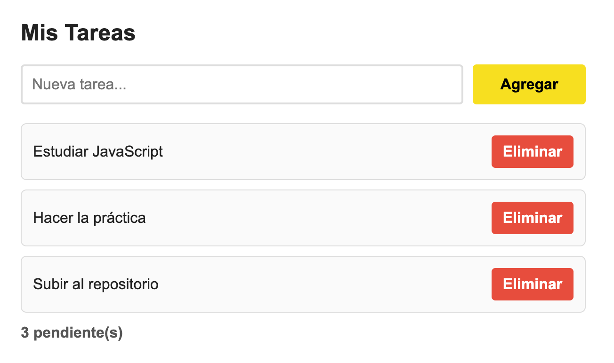
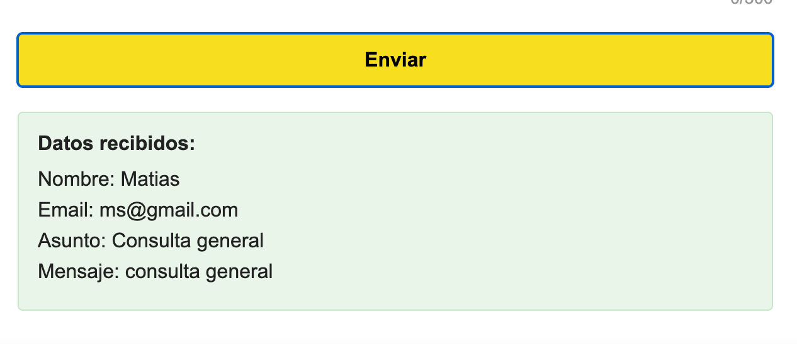
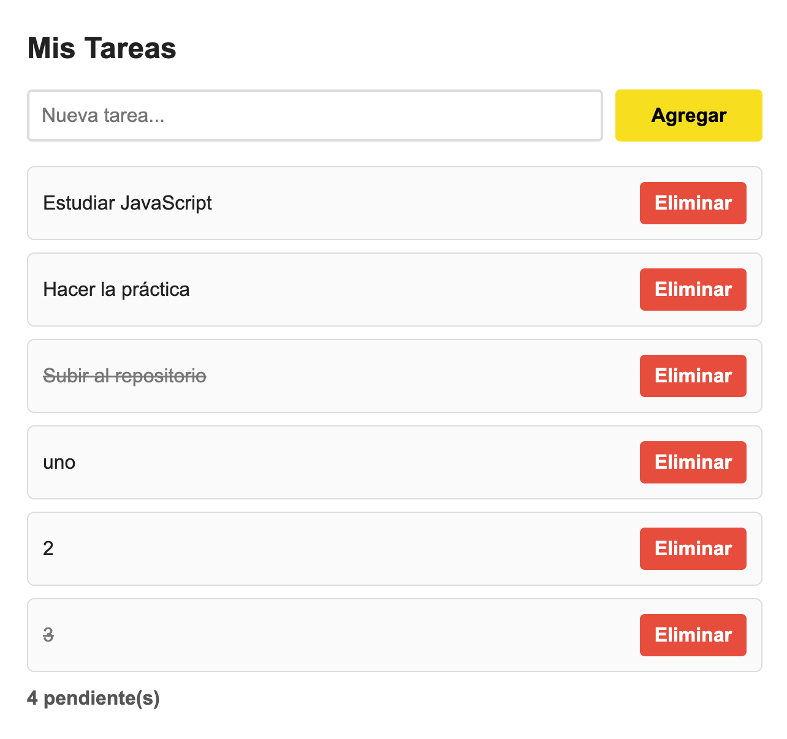

Empezamos con la lógica principal del formulario, con el codigo proporcionado s eexplica el reuso de una funcion para mejorar el estilo y legibilidad :

```javascript
function validarCampo(input, esValido, errorId) {
  const errorMsg = document.getElementById(errorId);

  if (esValido) {
    input.classList.remove("error");
    errorMsg.classList.remove("visible");
  } else {
    input.classList.add("error");
    errorMsg.classList.add("visible");
  }

  return esValido;
}
```

Con esto, cada campo específico (nombre, email, asunto, mensaje) solo tiene que llamar a esta función pasándole su propia condición. de esta forma:

```javascript
function validarNombre() {
  return validarCampo(
    inputNombre,
    inputNombre.value.trim().length >= 3,
    "error-nombre",
  );
}
```

Luego para el textbox que tenemos donde tenemos un max de 300 palabras, se pidio que cuando se haga un total de 270 o mas el `charCount.style.color = color;` cambia a color rojo como se muestra en la imagen siguiente.


Continuamos con los eventos de validación y limpieza de errores. Al querer usar los event listeners, se fortaleció el concepto del paso de parámetros en las funciones debido a que en el momento de limpiar un error porque al typear `inputNombre.addEventListener('input', limpiarError(inputNombre, 'error-nombre'))`. Esto me daba un comportamiento raro porque la función se ejecutaba inmediatamente al cargar la página en lugar de esperar al evento.

```javascript
inputNombre.addEventListener("input", () =>
  limpiarError(inputNombre, "error-nombre"),
);
```

Lo que entendí es que al poner los paréntesis estaba ejecutando la función en ese instante. Luego se uso una Arrow Function anónima para envolverla, y ahí funcionó perfectamente. También aprendí a diferenciar que para un `<select>` se usa el evento `'change'` y no `'input'`:

Luego continuamos con el evento `submit` del formulario. Aquí validamos todo de golpe y mejoramos la UX (Experiencia de Usuario) haciendo que, si un campo falla, el navegador haga `focus()` automáticamente en ese input para que el usuario no tenga que buscar dónde se equivocó.

```javascript
formulario.addEventListener("submit", (e) => {
  e.preventDefault();

  const nombreValido = validarNombre();
  // ... validaciones ...

  if (nombreValido && emailValido && asuntoValido && mensajeValido) {
    mostrarResultado();
    resetearFormulario();
    return;
  }

  // Manejo de focus si hay errores
  if (!nombreValido) {
    inputNombre.focus();
    return;
  }
  // ...
});
```

Además de esto, para darle un toque extra de accesibilidad, agregamos un atajo de teclado global escuchando al `document`. Si el usuario presiona `Ctrl + Enter`, el formulario se envía sin necesidad de usar el mouse.

Finalmente, integramos una lista de tareas dinámica. Primero preparamos el array de objetos base y las funciones para crear los elementos HTML (`<li>`, `<span>`, `<button>`).


Ahora con la **Delegación de Eventos** para manejar los clicks. En lugar de agregarle un `addEventListener` a cada botón de "Eliminar" (lo cual saturaría la memoria si hay 100 tareas), le agregamos un solo evento al contenedor padre (`listaTareas`) y buscamos qué se clickeó usando los `dataset`:

```javascript
listaTareas.addEventListener("click", (e) => {
  const action = e.target.dataset.action;

  // Verificar si el elemento clickeado es interactivo
  if (!action) return;

  // Obtener el <li> más cercano
  const item = e.target.closest("li");
  if (!item || !item.dataset.id) return;

  const id = Number(item.dataset.id);

  if (action === "eliminar") {
    tareas = tareas.filter((tarea) => tarea.id !== id);
    renderizarTareas();
    return;
  }

  if (action === "toggle") {
    const tarea = tareas.find((itemTarea) => itemTarea.id === id);
    if (tarea) {
      tarea.completada = !tarea.completada;
      renderizarTareas();
    }
  }
});
```

Quedándonos la vista y la interacción de la lista de esta forma


Tambien demostramos el funcionamiento del contador de tareas, antes se mostro el listado antes de agregar o completar una tarea ahora se muestra con mas elementos y se observa que el contador ha aumentado.

