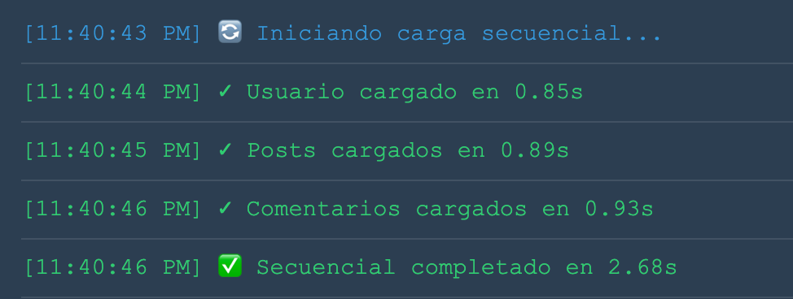
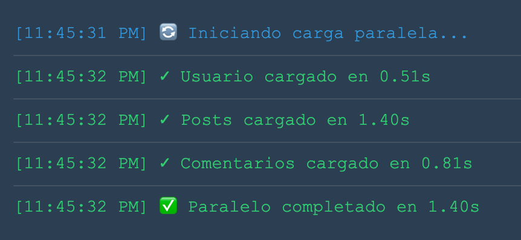
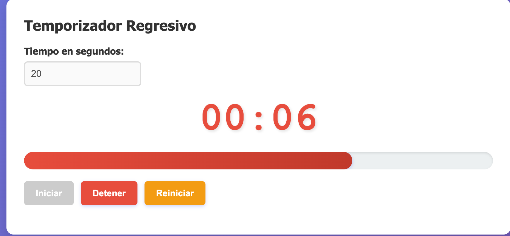
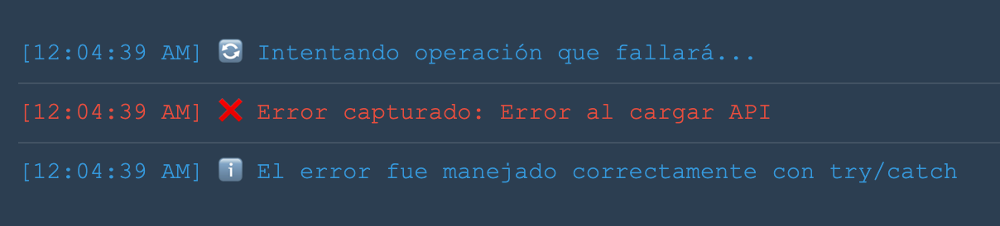
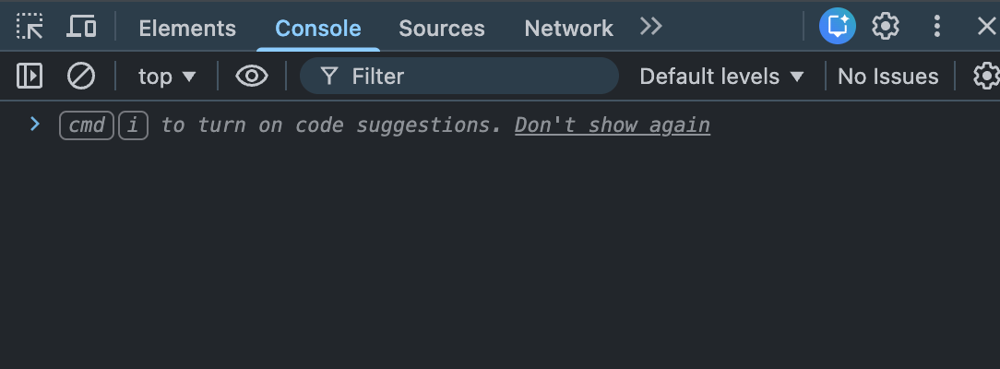

1. Carga secuencial vs paralela


**Descripción:** Al realizar la comparativa, la carga secuencial tomó alrededor de 2.68s, mientras que la carga paralela tomó solo 1.4s. 
Esta diferencia demuestra que usar `Promise.all` es fundamental para optimizar el rendimiento y la experiencia del usuario cuando las peticiones de datos no dependen unas de otras.

para lograr este flujo primero crearmos una funcion que retorna una promise con retraso
```javascript
function simularPeticion(nombre, tiempoMin = 500, tiempoMax = 2000, fallar = false) {
    return new Promise((resolve, reject) => {
        const tiempoDelay = Math.floor(Math.random() * (tiempoMax - tiempoMin + 1)) + tiempoMin;
        
        setTimeout(() => {
            if (fallar) {
                reject(new Error(`Error al cargar ${nombre}`));
            } else {
                resolve({ nombre, tiempo: tiempoDelay });
            }
        }, tiempoDelay);
    });
}
```

Luego, implementamos la carga secuencial usando `await` de forma consecutiva, lo cual bloquea la ejecución hasta que cada petición termina:

```javascript
async function cargarSecuencial() {
    try {
        const usuario = await simularPeticion('Usuario', 500, 1000);
        const posts = await simularPeticion('Posts', 700, 1500);
        const comentarios = await simularPeticion('Comentarios', 600, 1200);
    } catch (error) {
        mostrarLog(`❌ Error: ${error.message}`, 'error');
    }
}
```

Y la contrastamos con la carga paralela, donde disparamos todas las promesas al mismo tiempo con `Promise.all`:

```javascript
async function cargarParalelo() {
    try {
        const promesas = [
            simularPeticion('Usuario', 500, 1000),
            simularPeticion('Posts', 700, 1500),
            simularPeticion('Comentarios', 600, 1200)
        ];
        // Esperamos a que TODAS se resuelvan simultáneamente
        const resultadosPromesas = await Promise.all(promesas);
    } catch (error) {
        mostrarLog(`❌ Error: ${error.message}`, 'error');
    }
}
```

2. Temporizador en acción

Temporizador dinámico de cuenta regresiva con una barra de progreso que se actualiza cada segundo. Cuando el tiempo restante llega a 10 segundos o menos, la interfaz añade clases CSS de alerta para advertir al usuario visualmente.


Lo dificil de entender fue el validar para que no se generen múltiples intervalos corriendo al mismo tiempo si el usuario presiona "Iniciar" repetidas veces:

```javascript
function iniciar() {
    // Validamos que no haya un intervalo activo previamente
    if (intervaloId) return; 

    intervaloId = setInterval(() => {
        tiempoRestante--;
        actualizarDisplay();

        if (tiempoRestante <= 0) {
            detener();
            display.classList.add('alerta');
            alert('⏰ ¡Tiempo terminado!');
        }
    }, 1000);
}
```

3. Manejo de errores

Error capturado de forma controlada con un bloque `try/catch` y mostrado en la interfaz de usuario en nuestro propio "Log de Errores". Al manejar la excepción correctamente, evitamos que la aplicación web se rompa, logrando mantener la consola del navegador limpia (DevTools sin errores rojos).


```javascript
async function simularError() {
    try {
        // Llamamos a la petición forzando el rechazo (reject)
        await simularPeticion('API', 500, 1000, true);
    } catch (error) {
        // Capturamos el error y lo mostramos en la UI sin romper el código
        mostrarLogError(`❌ Error capturado: ${error.message}`, 'error');
        mostrarLogError('ℹ️ El error fue manejado correctamente con try/catch', 'info');
    }
}
```

