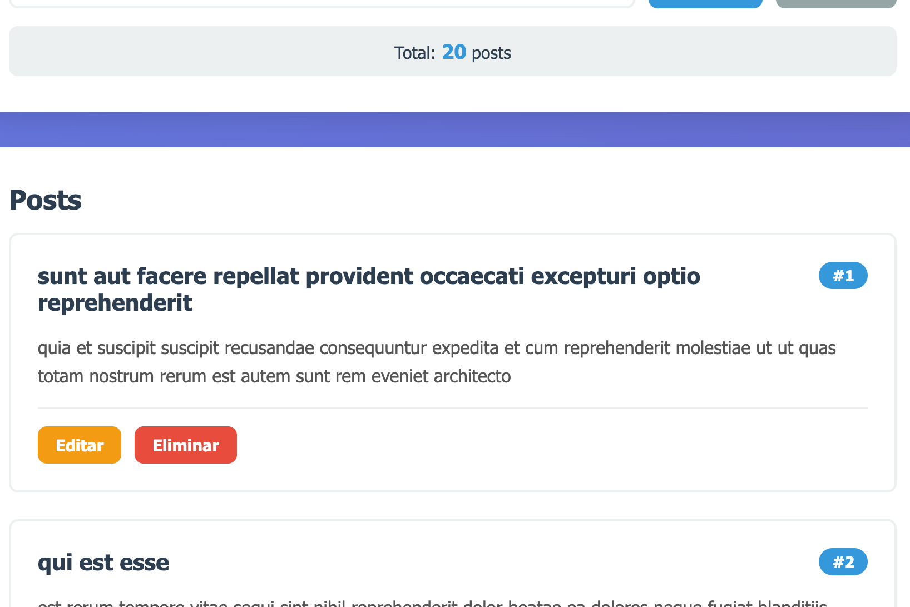
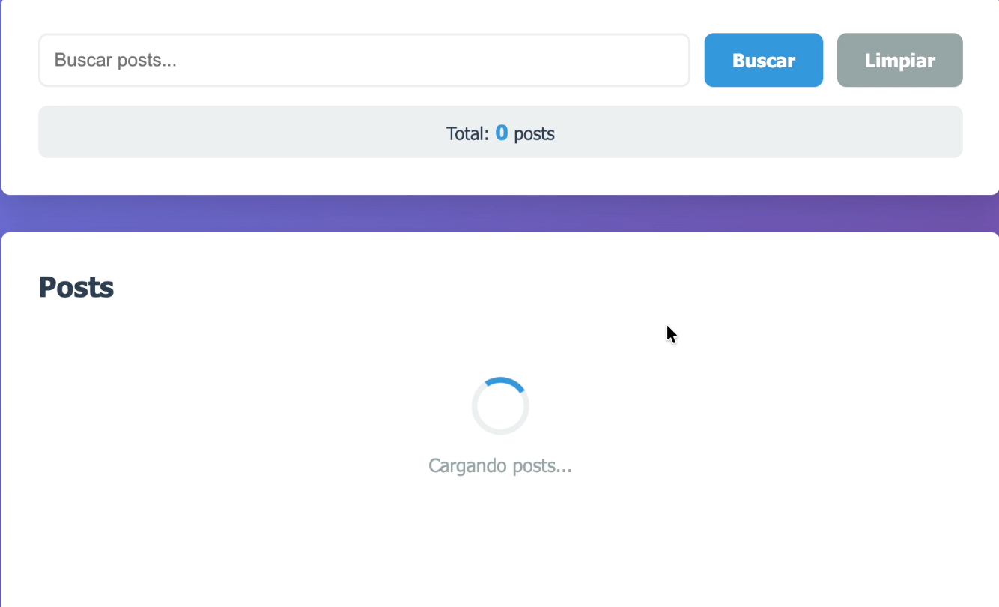
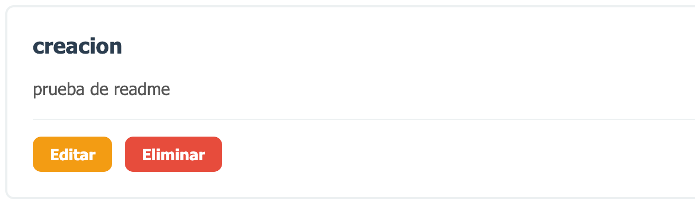
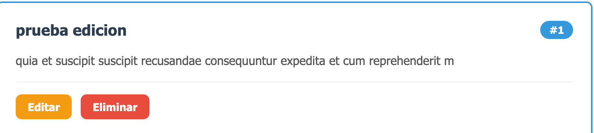
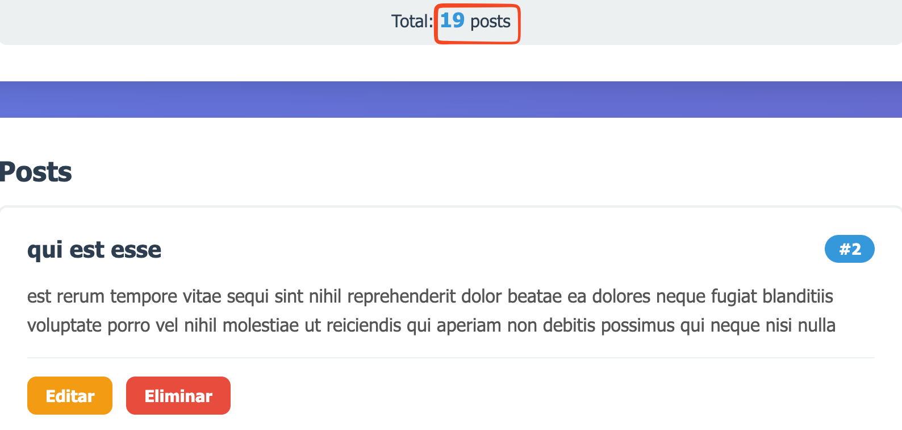

Funcion de cargar los posts dentro del app.js
```javascript
async function cargarPosts() {
  try {
    // TODO 6.2.1: Llamar a mostrarCargando() pasando listaPosts como parámetro
     mostrarCargando(listaPosts);

    // TODO 6.2.2: Llamar a ApiService.getPosts(20) y asignar el resultado a 'posts'
       posts = await ApiService.getPosts(20);

    // TODO 6.2.3: Copiar el array posts a postsFiltrados usando spread operator
       postsFiltrados = [...posts];

    // TODO 6.2.4: Llamar a renderizarPosts() pasando postsFiltrados y listaPosts
       renderizarPosts(postsFiltrados, listaPosts);

    // TODO 6.2.5: Llamar a actualizarContador()
       actualizarContador();

  } catch (error) {
    // Limpiar y mostrar error usando appendChild (no innerHTML)
    listaPosts.innerHTML = '';
    listaPosts.appendChild(MensajeError(`No se pudieron cargar los posts: ${error.message}`));
  }
}
```

Codigo relevante de la funcion spinner dentro de components 
```javascript
function Spinner() {
  // TODO 5.2.1: Crear un div con className 'loading'
    const container = document.createElement('div');
    container.className = 'loading';

  // TODO 5.2.2: Crear un div con className 'spinner' (el círculo animado)
    const spinner = document.createElement('div');
    spinner.className = 'spinner';

  // TODO 5.2.3: Crear un <p> con textContent 'Cargando posts...'
    const texto = document.createElement('p');
    texto.textContent = 'Cargando posts...';

  // TODO 5.2.4: Agregar spinner y texto al container con appendChild
    container.appendChild(spinner);
    container.appendChild(texto);

  // TODO 5.2.5: Retornar el container
  return container;
}
```

Codigo relevante de la creacion de un post dentro del app.js
```javascript
async function guardarPost(datosPost) {
  try {
    btnSubmit.disabled = true;
    btnSubmit.textContent = modoEdicion ? 'Actualizando...' : 'Creando...';

    let resultado;

    if (modoEdicion) {
       // TODO 7.1.1: Obtener el ID del input oculto y convertirlo a número
         const id = parseInt(inputPostId.value);

      // TODO 7.1.2: Llamar a ApiService.updatePost(id, datosPost) y guardar en resultado
         resultado = await ApiService.updatePost(id, datosPost);
      
      // Actualizar en el array local
      const index = posts.findIndex(p => p.id === id);
      if (index !== -1) {
        posts[index] = { ...resultado, id };
      }

      mostrarMensajeTemporal(
        mensajeEstado,
        MensajeExito(`Post #${id} actualizado correctamente`),
        3000
      );
```

Parte relevante para la edicion de posts
```javascript
function activarModoEdicion(post) {
  modoEdicion = true;
  inputPostId.value = post.id;
  inputTitulo.value = post.title;
  inputContenido.value = post.body;
  btnSubmit.textContent = 'Actualizar Post';
  btnCancelar.style.display = 'inline-block';
  
  // Scroll al formulario
  formPost.scrollIntoView({ behavior: 'smooth', block: 'start' });
  inputTitulo.focus();
}
```

Codigo relevante de la funcion de elimnar 
```javascript
async function eliminarPost(id) {
  // TODO 7.2.1: Usar confirm() para pedir confirmación. Si retorna false, salir de la función
    if (!confirm(`¿Eliminar el post #${id}?`)) {
    return;
    }

  try {
    // TODO 7.2.2: Llamar a ApiService.deletePost(id) con await
    await ApiService.deletePost(id);

    // TODO 7.2.3: Filtrar el post eliminado del array posts
    posts = posts.filter(p => p.id !== id);

    // TODO 7.2.4: Filtrar el post eliminado del array postsFiltrados
    postsFiltrados = postsFiltrados.filter(p => p.id !== id);

    renderizarPosts(postsFiltrados, listaPosts);
    actualizarContador();

    mostrarMensajeTemporal(
      mensajeEstado,
      MensajeExito(`Post #${id} eliminado correctamente`),
      3000
    );
```
