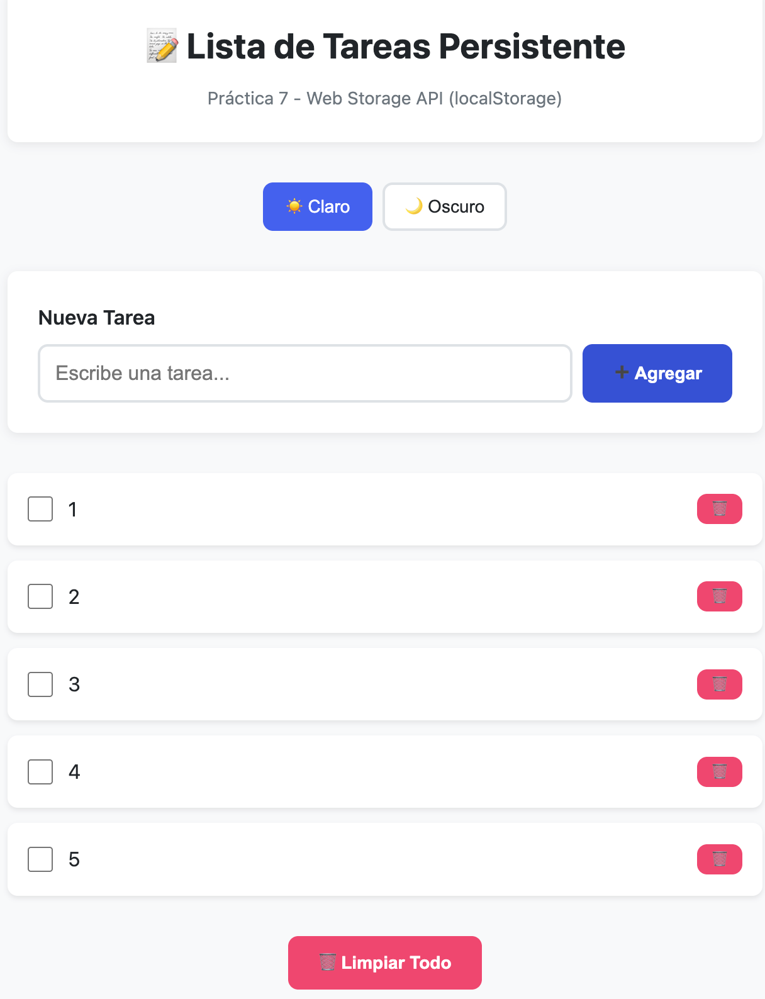
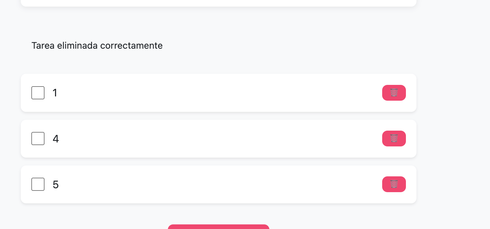
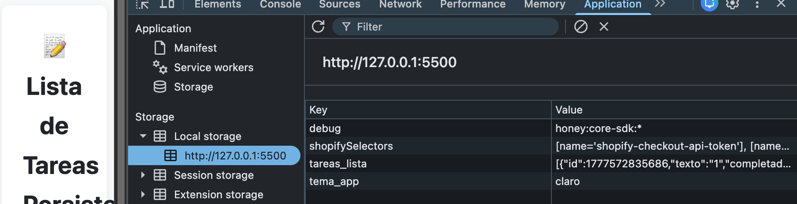
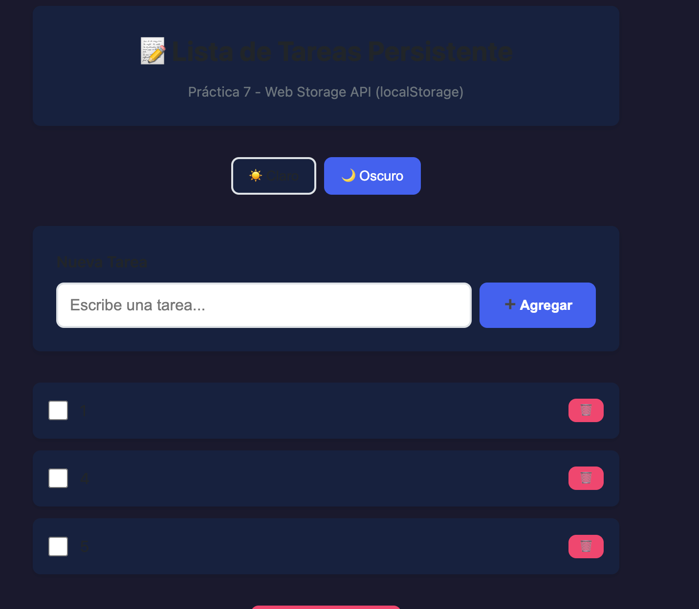

Se muestran los elementos cargados 

```javascript
function crearTarea(tarea) {
  const li = document.createElement('li');
  li.textContent = tarea.texto; // textContent escapa HTML automáticamente
  return li;
}
```
eliminacion de el elemento numero 2 y su mensaje

```javascript
function eliminarTarea(id) {
  // 1. Buscar la tarea para obtener su texto
  const tarea = tareas.find(t => t.id === id);
  
  if (!tarea) return; // Salir si por alguna razón no se encuentra
  
  // 2. Pedir confirmación al usuario
  if (!confirm(`¿Estás seguro de eliminar la tarea: "${tarea.texto}"?`)) {
    return; // Si el usuario cancela, detenemos la ejecución
  }
  
  // 3. Eliminar la tarea de localStorage
  TareaStorage.eliminar(id);
  
  // 4. Recargar el estado y volver a renderizar
  tareas = TareaStorage.getAll();
  renderizarTareas();
  
  // 5. Mostrar mensaje de éxito (ajusta esta llamada según cómo se llame tu función de mensajes)
  if (typeof mostrarMensaje === 'function') {
    mostrarMensaje('Tarea eliminada correctamente', 'exito');
  }
}
```
en la parte de aplicacion y storage se muestra las keys guardadas del localstorage

aplicacion del tema oscuro y el tema claro previamente ense;ado 

