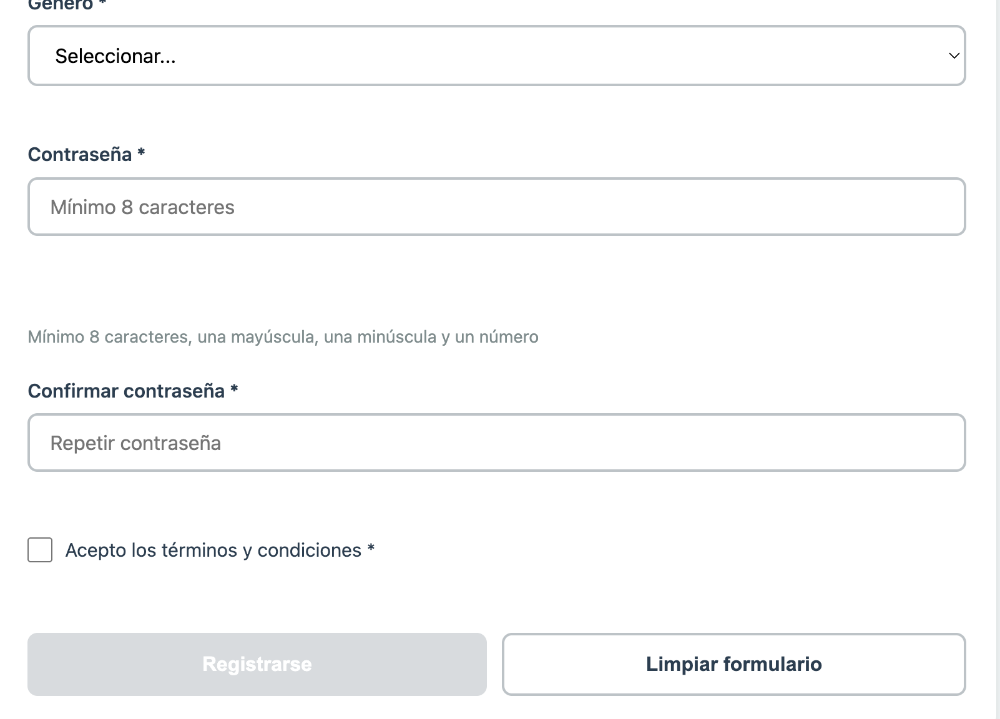
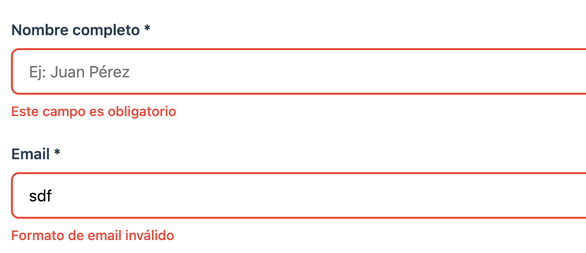
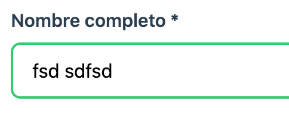
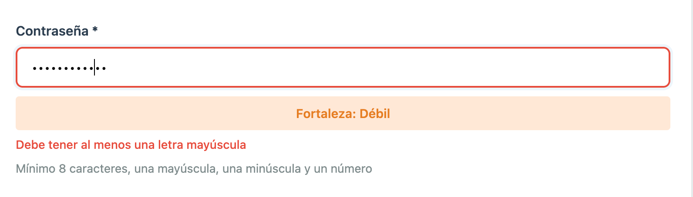
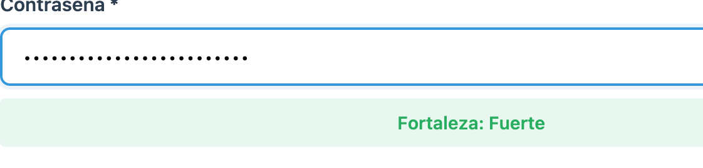
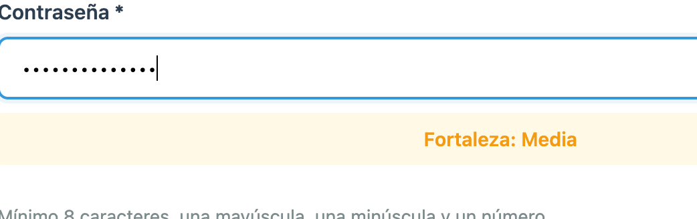
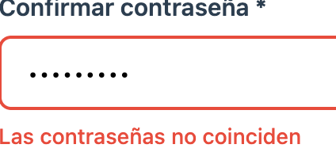
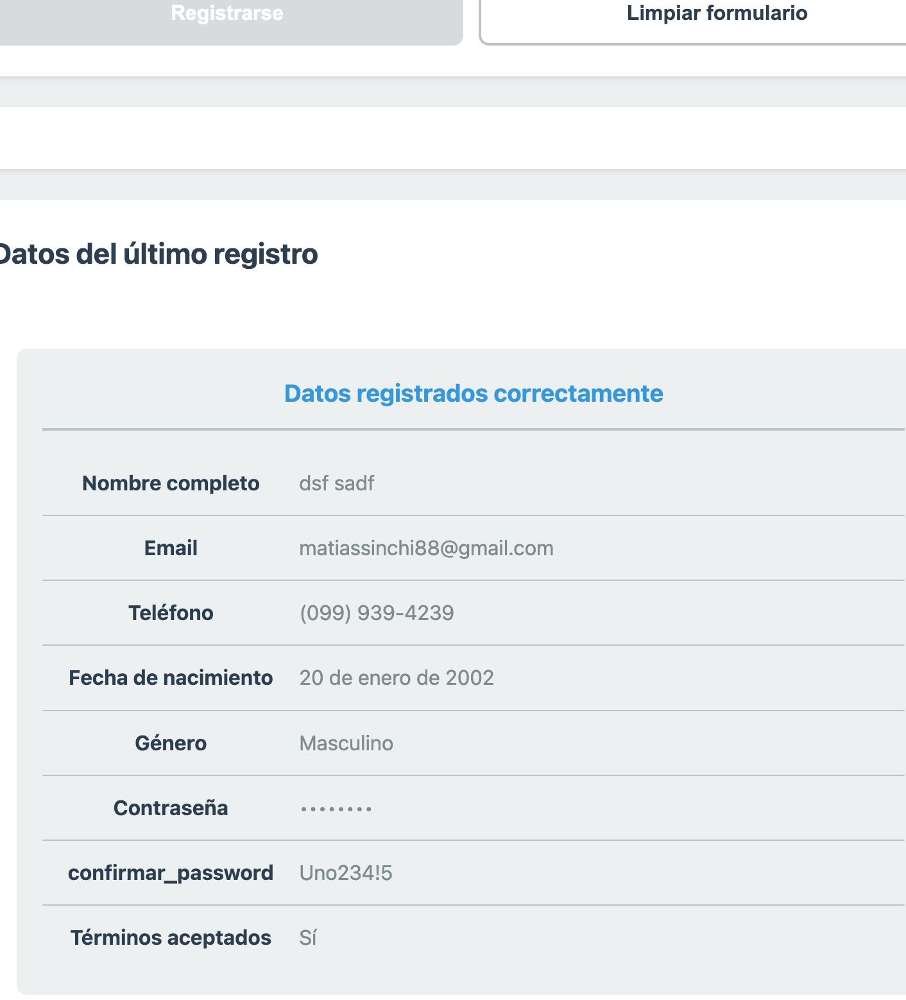

Se muestra el formulario vacio y el boton de registrar deshabilitado

se muestra erroes con la letra diferente

Muestra de una campo exitoso

3 diferentes tipos de validacion de una contrase;a 

Coincidencia de contrase;a

Datos registrados correctamente 
